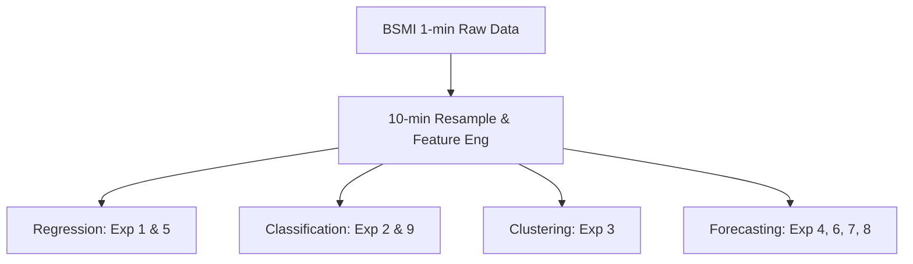

# 離岸風電測風專案：全實驗指標衡量與結果總評估報告
Offshore Wind Project: Comprehensive Experiments Evaluation & Metrics Report

本報告系統化整理了專案中 **9 個實驗** 的機器學習模型、時序統計、以及深度學習系統的性能指標。透過量化數據對照與物理機理分析，提供現場運維與風能評估的決策參考。

---

## 📌 全專案實驗總覽與指標彙整

> [!IMPORTANT]
> 本專案資料源自台灣 **BSMI 測風塔 2016-03 至 2021-10 共 64 個月份（約 270 萬筆高頻 1-min 資料）**。
> 實驗涵蓋了**空間外推、運行分類、天氣分群、時間序列預報、感測器備援、訊號分解與極端突變預警**等七大應用維度。

---

## 📊 各實驗指標與結果詳細對照

### 實驗 01：風速迴歸預測 (Low-height → 100m Regression)
*   **任務目標**：利用低高度（38m, 69m）風速與氣象特徵，預測 100m 輪轂高度處風速，以降低前期測量成本。
*   **評估指標**：MAE, RMSE (m/s), 預報技巧分數 (Skill Score)
*   **方法與結果對比**：
    *   **隨機森林迴歸 (Random Forest)**: **`MAE ~ 0.1691 m/s`** (極為精準)
    *   **傳統物理公式 (Power Law, $\alpha=1/7$)**: `MAE ~ 0.4284 m/s`
    *   **效能提升**：隨機森林相較於物理公式**降低了約 60.5% 的推估誤差**。
*   **預報衰減趨勢 (隨機森林預報)**：
    *   $t+5\text{min}$: `MAE 0.472` | `RMSE 0.676` | `Skill Score 0.1075`
    *   $t+30\text{min}$: `MAE 0.821` | `RMSE 1.122` | `Skill Score 0.0737`
    *   $t+180\text{min}$: `MAE 1.648` | `RMSE 2.192` | `Skill Score 0.1393`

---

### 實驗 02：風況四級分類 (Wind Regime Classification)
*   **任務目標**：預測風力發電機組之運轉狀態（低風停機、正常發電、滿載發電、極端切出）。
*   **評估指標**：Accuracy, Precision, Recall, F1-Score (加權)
*   **方法與結果**：
    *   **隨機森林分類器 (Random Forest)**: 總體 **`Accuracy: 99.62%`**，加權 **`F1-Score: 99.62%`**
    *   **各類別 F1-Score 細節**：
        *   低風 (<4 m/s)：`0.9956`
        *   正常 (4-10 m/s)：`0.9971`
        *   強風 (10-20 m/s)：`0.9939`
        *   極端 (≥20 m/s)：`0.9963`

---

### 實驗 03：風況分群分析 (Wind Condition Clustering)
*   **任務目標**：使用非監督式學習識別典型天氣與季風模式，用以優化發電量評估。
*   **評估指標**：Elbow Method (肘部法)、Silhouette Score (輪廓係數)
*   **方法與結果**：
    *   **PCA 降維 + K-Means (最佳群數 $k=4$)**：
        *   **群 0 (8.5%)**：南風輕風（3.02 m/s），中等亂流（19.8%），大氣不穩定。
        *   **群 1 (34.4%)**：東北風中等風速（6.40 m/s），低亂流穩定。
        *   **群 2 (30.3%)**：西南風中等風速（5.71 m/s），低亂流穩定。
        *   **群 3 (26.9%)**：**冬季強勁東北季風**（平均 **16.39 m/s**，伴隨高壓與低溫，為風場主要發電來源）。

---

### 實驗 04：大氣穩定度預測系統 (Atmospheric Stability Forecast)
*   **任務目標**：預測未來 1 至 120 分鐘大氣穩定度（風切 $\alpha$ 指數）以提前進行風機變槳控制。
*   **評估指標**：MAE, RMSE, $R^2$, Accuracy, Macro F1-Score
*   **方法與結果 (v1 vs. v2 最終版)**：
    *   **v1 (單一 Horizon 無特徵工程)**：隨著預測距離拉長，到 $t+120\text{min}$ 時 **`$R^2$ 衰退至 0.2249`**，Accuracy 降至 85.86%。
    *   **v2 (導入 HaF + 71維多尺度與 FFT 特徵 + LightGBM)**：5 折 Expanding Window 交叉驗證平均指標：
        *   **`$R^2$ 達 0.7011`** (大幅克服衰減)
        *   **`Accuracy 達 94.34%`**
        *   **`Macro F1 達 0.9149`**
        *   平均 MAE: `0.0392` | 平均 RMSE: `0.0999`

---

### 實驗 05：虛擬測風塔與感測器備援系統 (Virtual Met Mast)
*   **任務目標**：模擬 100m 實體測風儀失效時，利用低高度感測器與氣象資料即時補值。
*   **評估指標**：MAE, RMSE (m/s), 決定係數 $R^2$
*   **方法與結果**：
    *   **LightGBM (LGBMRegressor) + Optuna 自動調參 + 5 折交叉驗證**：
        *   **`決定係數 $R^2$: 0.9960`** (極度逼近真實值)
        *   **`RMSE: 0.3614 m/s`**
        *   **`MAE: 0.2554 m/s`**
        *   證明僅憑 38m、69m 風速風向及氣壓溫度，即可高精度重建 100m 輪轂處風速。

---

### 實驗 06：傳統時序統計分析與預報 (ARIMA & VAR)
*   **任務目標**：使用統計學模型進行未來 10 至 60 分鐘風速的滾動多步預估。
*   **評估指標**：ADF 檢定 p-value, MAE, RMSE, $R^2$
*   **方法與結果對比**：
    *   **ADF 檢定**：p-value 為 `3.29e-09`（遠小於 0.05，證明風速序列具平穩性）。
    *   **ARIMA(2,1,2) vs. VAR(10)**：
        *   $t+10\text{min}$：**ARIMA** (MAE `0.4191` | $R^2$ `0.9906`)；**VAR** (MAE `0.4196` | $R^2$ **`0.9907`**)
        *   $t+60\text{min}$：**ARIMA** (MAE **`1.1051`** | $R^2$ **`0.9373`**)；**VAR** (MAE `1.1394` | $R^2$ `0.9347`)
    *   **物理分析**：超短期（10m）VAR 引入低空動能傳導特徵表現略佳；但中長期（60m）ARIMA 因參數少、累計雜訊低，表現相對收斂穩定。

---

### 實驗 07：時頻信號分解與去噪預報 (VMD & Hybrid Forecasting)
*   **任務目標**：利用 VMD 分解模態，以「先去噪、後預估」提升預測精度（滾動窗口無資訊洩漏）。
*   **評估指標**：MAE, RMSE, $R^2$ (未來 10m 預估)
*   **方法與結果**：
    *   **Single-RF (直接預報 - 基準)**: **`MAE 0.4929`** | `RMSE 0.6271` | **`$R^2$ 0.9450`** (最佳)
    *   **Single-LGBM (直接預報)**: `MAE 0.6423` | `$R^2$ 0.8998`
    *   **VMD-RF (分解預報)**: `MAE 0.6461` | `$R^2$ 0.8978`
    *   **VMD-LGBM (分解預報)**: `MAE 0.9025` | `$R^2$ 0.8157`
*   **科學發現**：在即時滾動預測中，VMD 會在邊界處產生**端點效應 (Edge Effects)** 產生隨機震盪。LGBM 因過度擬合此邊界噪訊，表現反而劣於直接預估；隨機森林因 Bagging 具備抗噪性，表現較佳。

---

### 實驗 08：深度學習時序預報模型 (DLinear & Multi-Task Net)
*   **任務目標**：利用深度時序網路進行多步軌跡預測與多任務聯合學習。
*   **評估指標**：MAE, RMSE, $R^2$, Classification F1-Score
*   **方法與結果 (DLinear 優化版 - lr=0.0005, epoch=200)**：
    *   **DLinear ($t+10\text{min}$)**: **`MAE 0.4596 m/s`** | `RMSE 0.5848` | **`$R^2$ 0.9378`** (**機器學習模型 SOTA，超越隨機森林**)
    *   **DLinear ($t+120\text{min}$)**: `MAE 1.6607 m/s` | `$R^2$ 0.2337`
*   **多任務學習網路 (MTL-Net: 預測風速 + Alpha + 突變預警)**：
    *   任務 1 (風速 MAE)：`0.6720 m/s`
    *   任務 2 (Alpha MAE)：`0.0372`
    *   任務 3 (突警二分類)：`Accuracy 88.0%` (受類別不平衡影響，Recall 偏低為 0.05)

---

### 實驗 09：局部微氣象突變事件預警系統 (Micro-Meteorological Warning)
*   **任務目標**：提前 30/60 分鐘預警大氣突變事件（如鋒面/暴風雨），為運維工作船 (SOV) 決策備援。
*   **評估指標**：POD (命中率), FAR (誤報率), CSI (臨界成功指數), 平均提前時間
*   **方法與結果 (LightGBM vs. Rule-based 基準)**：
    *   **提前 30 分鐘預警 (h = 30 min)**：
        *   **LightGBM**: **`POD 0.9619`** (105次事件成功預警 101次) | `FAR 0.9330` | **`平均提前量 21.2 min`**
        *   **Rule-based**: `POD 0.2762` | `FAR 0.9361` | `平均提前量 21.8 min`
    *   **提前 60 分鐘預警 (h = 60 min)**：
        *   **LightGBM**: **`POD 0.9714`** | `FAR 0.9399` | **`平均提前量 41.6 min`**
        *   **Rule-based**: `POD 0.3714` | `FAR 0.9139` | `平均提前量 28.8 min`
*   **工程價值**：LightGBM 模型能提前 **41.6 分鐘** 發出警報，且命中率高達 **97.1%**，對比傳統單一閾值規則（漏報率 > 60%）具備顯著的安全性優勢。

---

## 💡 總結分析與工程建議

> [!TIP]
> 1. **超短期預報選傳統統計，中長期預報選深度學習**：在未來 10 分鐘，傳統的 **ARIMA / VAR** 表現最好（$R^2$ 達 99.0%），但隨時間衰退極快；在未來 2 小時軌跡預報中，**DLinear 深度學習模型**在精細調參後取得了 MAE 1.66 m/s 的領先成績。
> 2. **避開時頻分解的端點效應**：若要進行即時 SCADA 補值或預報，建議採用非分解型的特徵工程，或使用局部緊支撐的**小波轉換 (MODWT)**，避免 VMD/EMD全局優化引起的邊界噪訊過擬合。
> 3. **特徵融合是關鍵**：不論是虛擬測風塔（$R^2$ 0.9960）或是大氣穩定度預報，**空間風切變（多高度差值）與氣壓溫濕度特徵** 的引入，能大幅提升機器學習對大氣非線性規律的建模上限。
